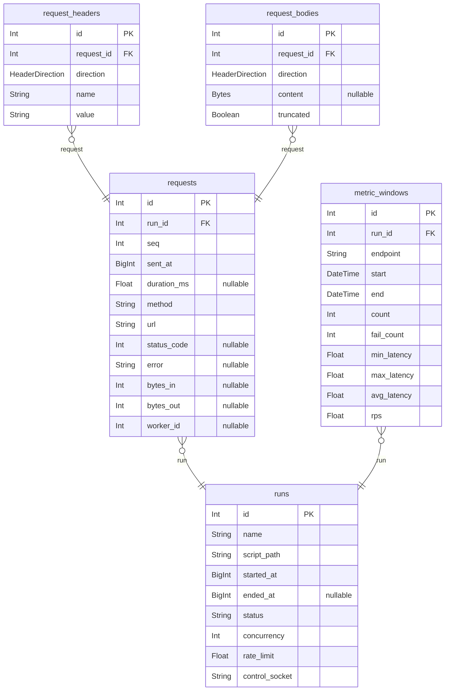

# Database Schema

> Generated by [`prisma-markdown`](https://github.com/samchon/prisma-markdown)

- [default](#default)

## default

### `runs`

Properties as follows:

- `id`:
- `name`:
- `script_path`:
- `started_at`:
- `ended_at`:
- `status`:
- `concurrency`:
- `rate_limit`:
- `control_socket`:

### `requests`

Properties as follows:

- `id`:
- `run_id`:
- `seq`:
- `sent_at`:
- `duration_ms`:
- `method`:
- `url`:
- `status_code`:
- `error`:
- `bytes_in`:
- `bytes_out`:
- `worker_id`:

### `request_headers`

Properties as follows:

- `id`:
- `request_id`:
- `direction`:
- `name`:
- `value`:

### `request_bodies`

Properties as follows:

- `id`:
- `request_id`:
- `direction`:
- `content`:
- `truncated`:

### `metric_windows`

Properties as follows:

- `id`:
- `run_id`:
- `endpoint`:
- `start`:
- `end`:
- `count`:
- `fail_count`:
- `min_latency`:
- `max_latency`:
- `avg_latency`:
- `rps`:
